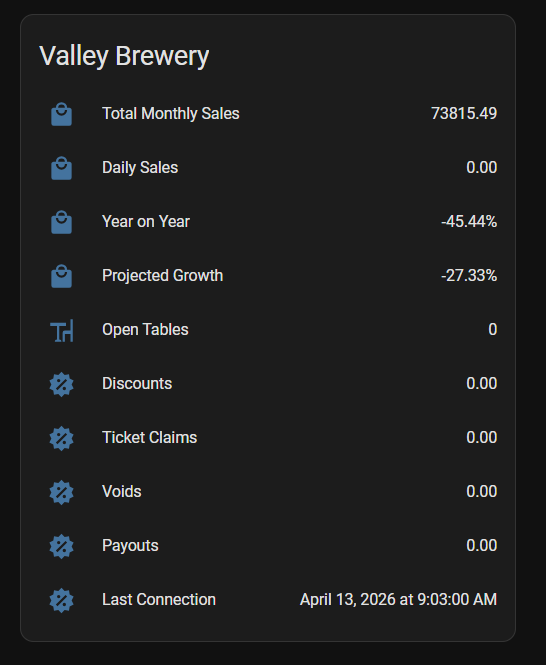

# HA Pilot Live 

Pilot Live Sensor for Home Assistant

# Manual Install

Instructions

1. Download and unzip to your Home Assistant `config/custom_components` folder.
  

  
Screenshot

  

  

  
2. Restart Home Assistant.

# Example Lovelace Card

Each store's metrics (sales, discounts, payouts, etc.) are exposed as
attributes on a single sensor. See
[`lovelace/example-card.yaml`](lovelace/example-card.yaml) for a card that
gives each attribute its own icon — swap in your store's entity ID.
